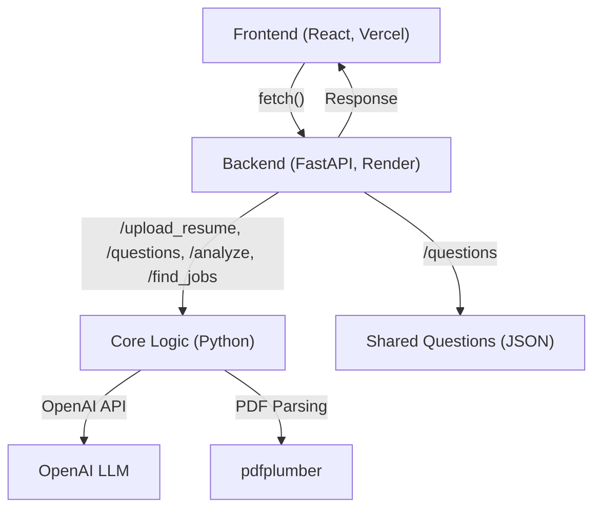

# Career Coach

**Career Coach** is an AI-powered career reflection and job-matching tool. It helps job seekers gain insight into their strengths, gaps, and potential next steps by analyzing resumes and self-reflection responses. The app generates a personalized career coaching report and matches users with relevant job opportunities—just like working with a career consultant, but automated and scalable.

---

## 🌐 [Live App: career-coach-theta.vercel.app](https://career-coach-theta.vercel.app/)
> _Live link tested and working as of June 27, 2025._

---

## 🚀 High-Level Architecture



- **Frontend**: React app hosted on Vercel, provides the user interface.
- **Backend**: FastAPI app hosted on Render, handles API requests and business logic.
- **Core Logic**: Python modules for resume parsing, profile analysis, and job matching.
- **Shared Data**: JSON file with career reflection questions.
- **External Services**: OpenAI API for AI-powered analysis.

---

## 🛠️ Low-Level Design

### Directory Structure

```
Career-coach/
  backend/           # FastAPI backend
    app.py           # Main API application
    start.sh         # Startup script for deployment
  core/              # Core business logic (Python modules)
    resume_parser.py
    career_qa.py
    profile_analyzer.py
    job_matcher.py
  shared/
    questions.json   # Shared reflection questions
  frontend/          # React frontend
    src/
      App.js         # Main React component
      ...
    package.json     # Frontend dependencies and scripts
  requirements.txt   # Python dependencies
  Dockerfile         # Containerization for backend
  docker-compose.yml # Local development orchestration
  deploy.sh          # Linux/macOS deployment script
  deploy.bat         # Windows deployment script
  README.md          # Project documentation
```

### Backend (FastAPI)
- **Endpoints:**
  - `/upload_resume` (POST): Upload and parse PDF resume
  - `/questions` (GET): Get reflection questions
  - `/analyze` (POST): Analyze resume and answers, generate coaching report
  - `/find_jobs` (POST): Match user profile to job opportunities
  - `/health` (GET): Health check
- **Core Modules:**
  - `resume_parser.py`: Extracts and parses resume text
  - `career_qa.py`: Handles career questions and answers
  - `profile_analyzer.py`: Merges and analyzes user profile
  - `job_matcher.py`: Finds relevant jobs based on analysis

### Frontend (React)
- **Features:**
  - Upload PDF resume
  - Redact PII client-side
  - Answer guided career questions
  - View AI-generated coaching report
  - See matched job opportunities
- **API Integration:** Uses `REACT_APP_API_URL` to connect to backend

### Shared
- `questions.json`: List of career reflection questions used by both frontend and backend

---

## 🧑‍💻 Tech Stack

| Layer       | Tools Used                                 |
|-------------|---------------------------------------------|
| Frontend    | React, Fetch API, Vercel                   |
| Backend     | FastAPI, Uvicorn, Render                   |
| AI/LLM      | OpenAI Chat Completions API                |
| File Parsing| pdfplumber, pdfminer.six                   |
| Prompt Logic| Custom GPT prompts, structured JSON        |
| Deployment  | Vercel (frontend), Render (backend), Docker|
| DevOps      | Docker, Docker Compose                     |

---

## 🎯 Key Learning Outcomes

- **Full-Stack AI Integration:** Learn how to connect a React frontend to a FastAPI backend and leverage OpenAI APIs for real-world applications.
- **Cloud Deployment:** Deploy both frontend and backend to modern cloud platforms (Vercel, Render).
- **Containerization:** Use Docker and Docker Compose for local development and portability.
- **CORS & Security:** Handle CORS, environment variables, and secure API key management.
- **PDF Parsing:** Extract and process resume data from PDF files using Python libraries.
- **Prompt Engineering:** Design effective prompts for LLMs and parse structured AI responses.
- **Job Matching Logic:** Implement rule-based and AI-assisted job matching.
- **Best Practices:** Organize code for maintainability, scalability, and collaboration.

---

## 📦 Setup & Local Development

### Prerequisites
- Python 3.8+
- Docker (optional, for containerized dev)
- OpenAI API key

### 1. Clone the Repository
```bash
git clone https://github.com/keyur-2992/Career-coach
cd career-coach
```

### 2. Backend Setup
```bash
cd backend
python -m venv venv
source venv/bin/activate  # On Windows: venv\Scripts\activate
pip install -r ../requirements.txt
touch .env  # Add your OPENAI_API_KEY
```

### 3. Run Backend
```bash
uvicorn app:app --reload --host 0.0.0.0 --port 8000
```

### 4. Frontend Setup
```bash
cd ../frontend
npm install
npm start
```

### 5. Docker Compose (Optional)
```bash
docker-compose up --build
```

---

## 🚀 Deployment

### Backend (Render)
- Build Command: `pip install -r requirements.txt`
- Start Command: `cd backend && ./start.sh`
- Environment Variables:
  - `OPENAI_API_KEY`: Your OpenAI API key
  - `PORT`: 8000

### Frontend (Vercel)
- Root Directory: `frontend`
- Build Command: `npm run build` or `react-scripts build`
- Output Directory: `build`
- Environment Variable:
  - `REACT_APP_API_URL`: Your backend Render URL (e.g., `https://career-coach-xxxx.onrender.com`)

### CORS Configuration
- In `backend/app.py`, ensure your deployed frontend URL is in `allow_origins` for CORS.

---

## 📝 Usage Guide

1. **Open the frontend app** (Vercel URL or `localhost:3000`)
2. **Upload your PDF resume**
3. **Redact any sensitive info (optional)**
4. **Answer the guided career questions**
5. **Receive your AI-generated coaching report**
6. **View matched job opportunities**

---

## 🧑‍🤝‍🧑 Contributing

1. Fork the repo and create a new branch (`feature/your-feature`)
2. Make your changes with clear commit messages
3. Test locally (backend and frontend)
4. Submit a pull request with a description of your changes

---

## 🛡️ Best Practices
- **Keep API keys secret:** Never commit `.env` or API keys
- **Use HTTPS** for all deployments
- **Handle errors gracefully** in both frontend and backend
- **Write modular, testable code**
- **Document new features and endpoints**

---

## 📚 Key Files Explained
- `backend/app.py`: Main FastAPI app and API endpoints
- `core/`: Business logic modules (resume parsing, analysis, job matching)
- `frontend/src/App.js`: Main React component
- `shared/questions.json`: Reflection questions
- `Dockerfile`, `docker-compose.yml`: Containerization and orchestration
- `deploy.sh`, `deploy.bat`: Deployment scripts for Linux/macOS and Windows

---

## 📖 Further Reading & Resources
- [FastAPI Documentation](https://fastapi.tiangolo.com/)
- [React Documentation](https://reactjs.org/docs/getting-started.html)
- [OpenAI API Reference](https://platform.openai.com/docs/api-reference)
- [Render Deployment Guide](https://render.com/docs/deploy-fastapi)
- [Vercel Documentation](https://vercel.com/docs)
- [Docker Documentation](https://docs.docker.com/)

---

## 🏆 License

This project is licensed under the MIT License. See [LICENSE](LICENSE) for details.

---

## 🙌 Acknowledgements
- OpenAI for the LLM API
- pdfplumber and pdfminer.six for PDF parsing
- Render and Vercel for free-tier hosting
- All contributors and testers!